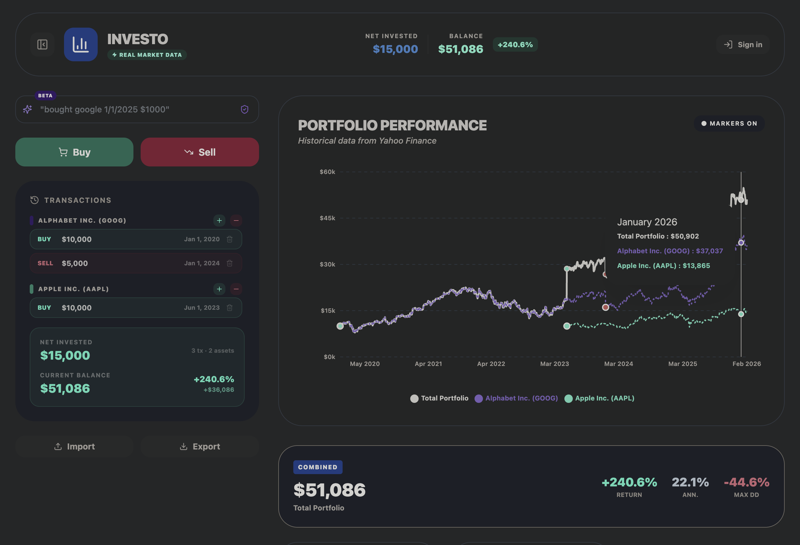

# Investo

**[Live Demo →](https://whatihave.xyz)** · [Buy me a coffee ☕](https://buymeacoffee.com/br3gan)

An investment portfolio simulator that uses real market data from Yahoo Finance. Build a virtual portfolio by recording buy/sell transactions and track performance over time.

> **Disclaimer:** Investo is a simulation tool only. No real money is involved — it does not execute any actual trades or connect to any brokerage. All transactions are virtual records used to simulate portfolio performance against real historical market data.



## Features

### Core
- **Transaction Ledger** — Record buy/sell transactions for stocks and deposit/withdraw for cash
- **Real Market Data** — Historical prices fetched from Yahoo Finance API
- **Bank Account Tracking** — Track cash deposits and withdrawals alongside your investments
- **Performance Stats** — Total return, annualized return, and max drawdown per asset
- **Hide from Net Worth** — Toggle visibility of specific assets in your net worth calculations

### AI-Powered
- **AI Quick Add** — Natural language transaction input:
  - `"bought google 1/1/2025 $1000"`
  - `"sold half of my apple 6 months ago"`
  - `"deposit $5000 to bank"`
- **AI Insights** — Get intelligent portfolio analysis that considers both your stock performance and cash position for holistic financial health assessment

### Visualization
- **Interactive Charts** — Multiple chart views with time range filters (24H, 1W, 1M, 6M, YTD, 5Y, ALL):
  - Net worth over time
  - Stock performance comparison
  - Asset allocation (pie chart)
  - Deposits vs value
  - Returns by asset
  - Individual asset price history
  - Bank balance over time
- **Chart Categories** — Switch between All, Stocks, and Bank views
- **Buy/Sell Markers** — Visual indicators on charts with click-to-toggle legend

### Data Management
- **CSV Import/Export** — Bulk import transactions or export your portfolio
- **Cloud Sync** — Sign in with Google to sync across devices (via Supabase)
- **Local Persistence** — Portfolio auto-saved to localStorage for offline use
- **Dark Mode** — Synced across devices for signed-in users

## Tech Stack

- React 19 + Vite
- Tailwind CSS 4
- Recharts
- Supabase (auth + storage)
- Lucide React icons

## Getting Started

```bash
npm install
npm run dev
```

### Environment Variables

For cloud sync, create a `.env` file:

```
VITE_SUPABASE_URL=your-supabase-url
VITE_SUPABASE_ANON_KEY=your-supabase-anon-key
```

Cloud sync is optional — the app works fully offline with localStorage.

### AI Features Setup (Optional)

The AI-powered features require deploying Supabase Edge Functions:

#### AI Quick Add
1. Get a free Google Gemini API key from [aistudio.google.com](https://aistudio.google.com/app/apikey)
2. Deploy the Edge Function:

```bash
npx supabase login
npx supabase link --project-ref YOUR_PROJECT_REF
npx supabase secrets set GEMINI_API_KEY=YOUR_KEY
npx supabase functions deploy parse-transaction
```

**Without this function**, the app falls back to a basic regex-based parser that works offline but with limited capabilities.

#### AI Insights
1. Get an OpenAI API key from [platform.openai.com](https://platform.openai.com/api-keys)
2. Deploy the Edge Function:

```bash
npx supabase secrets set OPENAI_API_KEY=YOUR_KEY
npx supabase functions deploy generate-insights
```

**Without this function**, the Insights button will not appear.

See [supabase/functions/README.md](supabase/functions/README.md) for detailed setup instructions.

## Deployment

Deployed on [Vercel](https://vercel.com). The `vercel.json` config proxies Yahoo Finance API requests to avoid CORS issues in production.

## License

MIT
